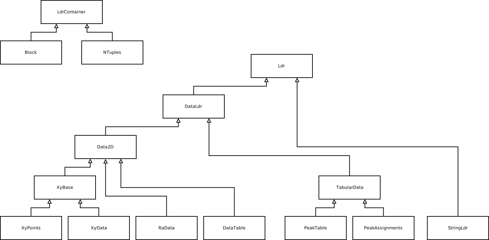

[](https://gitlab.com/devrosch/libjdx/commits/master)
[](https://devrosch.gitlab.io/libjdx/coverage)

# libjdx

Library for reading JCAMP-DX data, written in C++.

## Details

This library provides meachnisms to read data in the JCAMP-DX format ([jcamp-dx.org](http://www.jcamp-dx.org/)) with a focus on:
* [JCAMP-DX IR](http://www.jcamp-dx.org/protocols/dxir01.pdf)
* [JCAMP-DX NMR](http://www.jcamp-dx.org/protocols/dxnmr01.pdf)
* [JCAMP-DX MS](http://www.jcamp-dx.org/protocols/dxms01.pdf)
Several other flavors, e.g., for IMS and hypenated techniques should also work.

JCAMP-DX data is organized into so-called labeled data records (LDRs) that can hold data from simple strings to intricate multi-dimensional structures. Many special LDRs are fully supported, also see diagram below. If no special support is provided, the LDR value is treated as a string.

## Limitations

* There is no special support for technique specific LDRs (e.g., ACQUISITION
TIME, COUPLING CONSTANTS, or IONIZATION MODE). Their values are treated as strings.
* No X value check is performed for (X++(Y..Y)) type data (relevant for for XYDATA, RADATA, and DATA TABLE LDRs). Instead, the ascissa values are derived exclusively from LDRs such as FIRSTX, LASTX, XFACTOR, NPOINTS or equivalent ones.
* No vendor specific extensions of the JCAMP-DX standard are supported.
* [JCAMP-CS](http://www.jcamp-dx.org/protocols/dxcs01.pdf) is not supported.
* T1 T2, F1, F2 is currently not supported as abscissa variables.

# Getting Started

## Prerequisites

You will need a recent version of git, CMake >= 3.15, a C++ compiler that is compliant with C++17 (e.g. recent versions of GCC and Clang/LLVM) to download the source code and to build this library.

For compiling to WebAssembly (WASM), you need to have the Emscripten EMSDK set up. 
For running tests for Emscripten compiled code, Node.js (available as command "node") is required.

## Build

Both native build and cross compilation to WebAssembly (WASM) is supported (tested on Linux).

### Native

Create a build directory anywhere (e.g., as sub directory in the project's root directory), cd into it and run:
```
cmake <path/to/project/dir>
```
followed by:
```
cmake --build
```

### WASM

Build WebAssembly with Emscripten using the commands:
```
emcmake cmake <path/to/project/dir>
```
followed by:
```
cmake --build
```

## Test

For running automated tests, in the build directory run:
```
ctest
```

The latest test report from the CI/CD pipeline is located at: [GitLab Pages](https://devrosch.gitlab.io/libjdx/coverage)

## Documentation

Documentation generated during the build by the CI/CD pipeline is located at: [GitLab Pages](https://devrosch.gitlab.io/libjdx/doc)

Inheritance diagram of classes:



## Example

```cpp
// open file
const std::string path{"pat/to/data.jdx"};
auto istream = std::make_unique<std::ifstream>(path);

// Block is the root element in any JCAMP-DX data set
auto block = sciformats::jdx::JdxParser::parse(std::move(istream));

// get LDRs that are not specially treated
const auto& ldrs = block.getLdrs();

// optional
const auto& xyData = block.getXyData().has_value();
if (xyData)
{
    auto data = xyData.value().getData();
    for (const auto& xyPair : data)
    {
        cout << "x: " << xyPair.first << ", y: " << xyPair.second << "\n";
    }
}

```

## Sample data

Public domain sample data taken from [JSpecView2](http://wwwchem.uwimona.edu.jm/spectra/JSpecView2/sample/).

## Built With

For development:

* [Catch2](https://github.com/catchorg/Catch2/releases/download/v2.13.1/catch.hpp) (license: [Boost](https://github.com/catchorg/Catch2/blob/master/LICENSE.txt), source code: [GitHub](https://github.com/catchorg/Catch2))

and their various dependencies.

## Authors

* **Robert Schiwon** - [devrosch](https://gitlab.com/devrosch)

## License

Copyright (C) 2020-2022 Robert Schiwon

This program is free software: you can redistribute it and/or modify it under the terms of the GNU General Public License as published by the Free Software Foundation, either version 3 of the License, or (at your option) any later version.

This program is distributed in the hope that it will be useful, but WITHOUT ANY WARRANTY; without even the implied warranty of MERCHANTABILITY or FITNESS FOR A PARTICULAR PURPOSE. See the GNU General Public License for more details.

You should have received a copy of the GNU General Public License along with this program.  If not, see <http://www.gnu.org/licenses/>.

# Scratchpad

Build WebAssembly with Emscripten using the following commands:
```
emcmake cmake <path/to/project/dir>
```
followed by:
```
make
```
or
```
cmake --build . --verbose
```

For running tests for Emscripten compiled code, Node.js (available as command "node") is required. Run:

```
ctest -VV
```

see: [Emscripten](https://emscripten.org/docs/getting_started/downloads.html)
see: [Stack Overflow](https://stackoverflow.com/questions/15724357/using-boost-with-emscripten)


```
docker run --rm -v $(pwd):/src -u $(id -u):$(id -g) emscripten/emsdk emcc -std=c++17 USE_BOOST_HEADERS=1 -Iinclude src/binary_reader.cpp -o binary_reader.js
```

```
docker run --rm -v $(pwd):/src -u $(id -u):$(id -g) emscripten/emsdk emcc -std=c++17 -s USE_ICU=1 -Iinclude src/binary_reader.cpp apps/main.cpp -o binary_reader.html
```

```
python -m SimpleHTTPServer
```

```
docker run --rm -v $(pwd):/build -p 8080:8080 -u $(id -u):$(id -g) emscripten/emsdk emrun --port=8080 --no_browser /build/main.html
```

